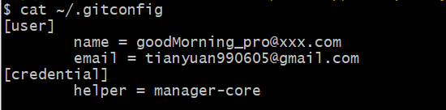
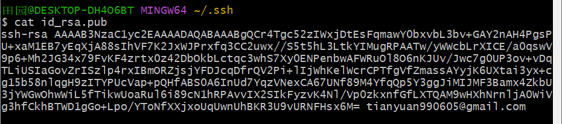

###为什么要使用版本控制工具？
* 协同修改，多人修改同一个文件
* 数据备份，不仅能保存目录和文件的当前状态，还可以保存每一个提交过的文件的历史状态
* 版本管理，保存每一个版本的文件信息时不能重复数据
* 权限控制，如，测试人员只有只读的权限，开发人员有读写的权限，且团队不授权别想用
* 历史记录，可以查看作者，提交者，修改人/时间/内容等；可以将文件恢复到某个历史状态
* 分支管理，允许多条生产线同时推进任务

###版本控制
* 优点：一部电脑嘎了，在另一部电脑上可以找到数据
  * 

###Git优势
* 

###Git结构
* 

###Git和代码托管中心
* 代码托管中心的任务：维护远程库
* 局域网环境下
  * GitLab服务器
* 外网环境下
  * GitHub
  * 码云

###本地库和远程库
* 团队内部协作
  * 
* 跨团队协作
  * 

###4.Git命令行操作
* ***4.1本地库/版本库初始化***
  * 命令：git add
  * 效果：
  * 注意：.git目录中存放的是本地库相关的子目录和文件，不能删除，也不能胡乱修改

* ***4.2设置签名***
  * 形式
    * 用户名
    * email地址：
  * 作用：区分不同开发人员的身份
  * 辨析：这里设置的签名和登录远程库（代码托管中心）的账号、密码没有任何关系
  * 命令：
    * 项目/仓库级别：仅在当前本地库范围内有效
      * git config user.name tom pro
      * git config user.email goodMorning_pro@xxx.com
      * 保存信息位置：./.git/config 文件
        * 
    * 系统用户级别：登录当前操作系统地用户范围
      * git config --global user.name tom_global
      * git config --global user.name goodMorning_pro@xxx.com
      * 保存信息位置：~/.gitconfig 文件
        * 
    * 级别优先级
      * 就近原则：项目级别优先于系统用户级别，二者都有时采用项目级别的签名
      * 如果只有系统用户级别的签名，就以系统用户级别的签名为准
      * 二者都没有不允许

* ***4.3基本操作***
  * **4.3.1 状态查看操作**
    * git status 查看工作区、暂存区的状态

  * **4.3.2 添加操作**
    * git add 文件名  将工作区的新建/修改添加到暂存区

  * **4.3.3 提交操作**
    * git commit -m "commit message" 文件名  将暂存区的内容提交到本地库/版本库

  * **4.3.4 查看历史记录操作**
    * git log  
      * 多屏显示控制方式：空格向下翻页；b 向上翻页；q 退出
    * git log --pretty=oneline  
    * git log --oneline(只取部分hash值)  
    * git reflog  
      * HEAD@{移动到当前版本需要多少部}

  * **4.3.5 前进后退**
    * 本质：可以根据指针（HEAD）将当前所在的版本向前向后移动
    * 基于索引值操作（推荐使用）
      * git reset --hard 局部索引值 eg： git reset --hard 06fa4f8
    * 使用^符号：只能后退
      * git reset --hard HEAD^
      * 注：一个^表示后退一步，n个表示后退n步
    * 使用~符号：只能后退
      * git reset --hard HEAD~n
      * 注：表示后退n步
  * **reset命令的三个参数对比**
    * --soft参数
      * 仅仅在本地库移动HEAD指针
    * --mixed参数
      * 在本地库移动HEAD指针
      * 重置暂存区
    * --hard参数
      * 在本地库移动HEAD指针
      * 重置暂存区
      * 重置工作区

  * **4.3.7 删除文件并找回**
    * 前提：删除前，文件存在时的状态提交到了本地库
    * 操作：git reset --hard HEAD[指针位置]
      * 删除操作已经提交到本地库：指针位置指向历史记录
      * 删除操作尚未提交到本地库，指针位置使用HEAD

  * **4.3.8 比较文件差异**
    * git diff [文件名]
      * 将工作区中的文件和暂存区进行比较
    * git diff [本地库中的历史版本][文件名]
      * 经工作区中的文件和本地库历史记录比较
    * 不带文件名比较多个文件

* ***4.4分支管理***
  * ***4.4.1什么是分支？***
    * 在版本控制过程中，使用多条线同时推进多个任务

  * ***4.4.2分支的好处***
    * 同时并行推进多个功能开发，提高开发效率
    * 如果其中一个分支开发失败，也不会影响其他分支，失败的分支删除后重新写就行

  * ***4.4.3分支操作***
    * 创建分支
      * git branch[分支名]
    * 查看分支
      * git branch -v
    * 切换分支
      * git checkout [分支名]
    * 合并分支
      * 第一步：切换到接受修改的分支（被合并，增加新内容）上
        * git checkout [被合并的分支名]
        * 
      * 第二步：执行merge命令
        * git merge [有新内容的分支名]
        * 
    * 解决冲突
      * 冲突的表现
        * 
      * 冲突的解决
        * 第一步：编辑文件，删除特殊符号
        * 第二步：把文件修改到满意的程度，保存退出
        * 第三步：git add[文件名]
        * 第四步：git commit -m "日志信息"
          * 注：此时commit一定不能带具体文件名
        * 

###5.Git基本原理
  * ***5.1哈希***
    *
  * ***5.2Git保存版本的机制***
    * ***5.2.1集中式版本控制工具的文件管理机制***
      *

###6.GitHub

  * ***6.5克隆***
    * 命令：
      * git origin[远程地址]
      * 
    * 效果：
      * 完整的把远程库下载到本地
      * 创建origin远程地址别名
      * 初始化本地库

  * ***6.6团队成员邀请***
    * 主页中Settings->左侧Collaborators->绿色的Add People->输入成员的邮箱->点击邀请，等待同意

  * ***6.7拉取***
    * pull=fetch+merge
    * git fetch[远程库地址别名][远程分支名]
    * git merge[远程库地址别名/远程分支名]
    * git pull[远程库地址别名][远程分支名]

  * ***6.8解决冲突***
    * 要点：
      * 如果不是基于GitHub远程库的最新版所做的修改，不能推送，必须先拉取
      * 拉取下来后如果进入冲突状态，则按照“分支冲突解决”操作解决即可
      * 
      * 
    * 类比：
      * 债权人：老六
      * 债务人：小丑

      * 老六说：10天后还钱，小丑接受，双方达成一致
      * 老六媳妇说：5天后还，小丑无法接受。老六媳妇需要和老六确认后再执行

  * ***6.9跨团队合作***
    * Fork
    *
    * 本地修改
    * Pull Request
    * 可以对话
    * （项目经理）审核代码
    * （项目经理）回到对话界面，点击"Merge pull request"进行合并代码的操作
    * 将远程库修改拉取到本地

  * ***6.10SSH登录***
    * 进入当前用户的家目录
      * $ cd~
    * 删除.ssh 目录
      * $ rm -rvf .ssh
    * 运行命令生成ssh密钥目录
      * $ ssh-keygen -t rsa -C gmail
      * [注意：这里-C这个参数是大写的C]
    * 进入.ssh目录查看文件列表
      * $ cd .ssh
      * $ ls -lF
    * 查看.id_rsa.pub文件内容
      * cat id_rsa.pub
      * 
    * 复制.id_rsa.pub文件内容，登录GitHub，点击用户头像->Setting->SSH and GPG keys
    * 创建New SSH Key
    * 输入复制的密钥信息
    * 回到GitHub创建远程地址别名，已经创建过的话，直接推送即可
      * git remote add origin_ssh [SSH地址别名]
    * 推送文件进行测试
      * git push origin_ssh master
    * 刷新就可以看到修改的内容

###总结
* 开发项目时涉及很多的类、方法，修改时会很混乱，使用git会减少工作量，提高效率
* 在开发过程中，每个历史状态都需要有个记录，有了记录就可以回到某个特定的历史状态进行增删改（修改）操作
* 有利于团队协作，不光可以管文件本身，也可以管文件里的内容，可以让很多人同时修改文件里的内容
